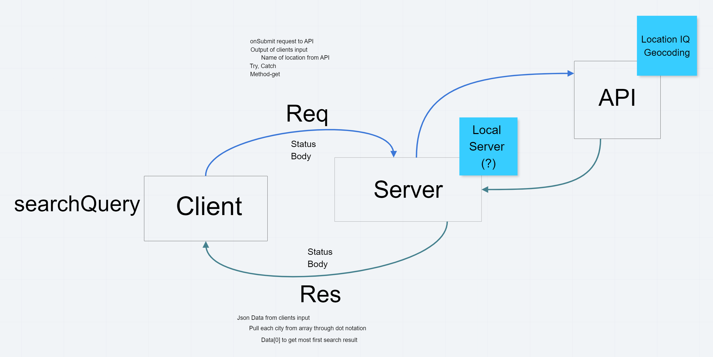
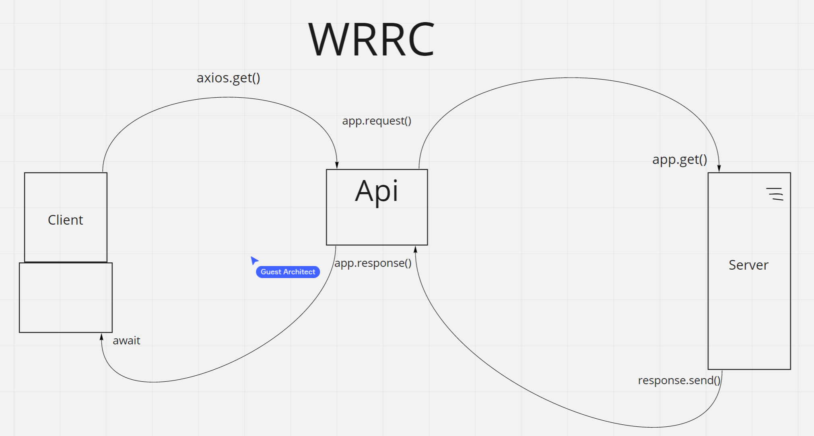
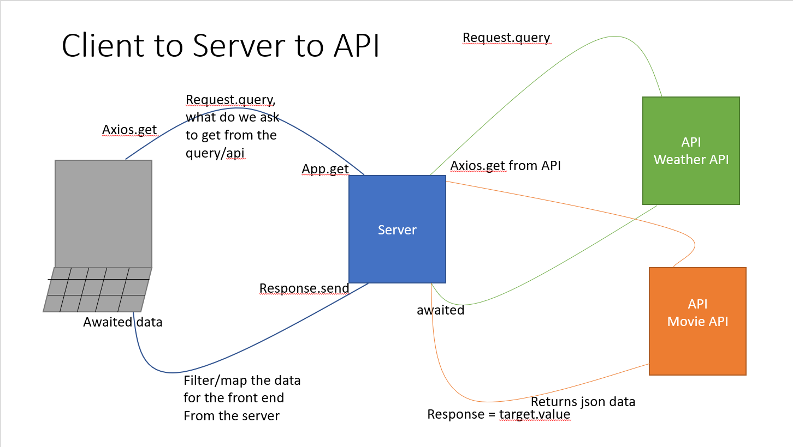

# Project Name

**Author**: Charlie Fadness
**Version**: 1.3.0 (increment the patch/fix version number if you make more commits past your first submission)

## Overview
<!-- Provide a high level overview of what this application is and why you are building it, beyond the fact that it's an assignment for this class. (i.e. What's your problem domain?) -->

[Link to Netlify Application](https://nifty-wilson-350d48.netlify.app)

Through this application you can search through the most popular cities, it then will display the Longitude, and Latitude. An image will appear as well.

If you do not set your own key from LocationIQ, it will return an error.

## Getting Started

<!-- What are the steps that a user must take in order to build this app on their own machine and get it running? 
-->

- Pull down from this Repo
- Do `npm i` to install all the nessessary packages inside this react file while in your terminal
- Create a .env file
  - Place your key from LocationIQ inside .env file as:
    - `REACT_APP_`Variable Name All Caps`=`LocationIQ Key
- Load to netify through GitHub or run local host

## Architecture
<!-- Provide a detailed description of the application design. What technologies (languages, libraries, etc) you're using, and any other relevant design information. -->

UML for starting City Explorer

- React
- React-BootStrap
- Axios
- JavaScript
- HTML
- CSS
- JSX

### UML for Day 1 - Front End, Server, API?

### UML for Day 2 - Front End to API

### UML for Day 3 - Front End to Server to API

## Change Log

<!-- Use this area to document the iterative changes made to your application as each feature is successfully implemented. Use time stamps. Here's an example:

01-01-2001 4:59pm - Application now has a fully-functional express server, with a GET route for the location resource. -->

07-28-2021 - [GitHub Pull Request 699159705](https://github.com/fadnesscharlie/city-explorer/pull/1#issue-699159705) - City, Longitude, and Latitue display when chosen city is input

07-28-2021 - [GitHub Pull Request 699177301](https://github.com/fadnesscharlie/city-explorer/pull/2#issue-699177301) - Image loads on city input and error message applies if ex. key is broken.

7/28/2021 - [GitHub Pull Request 699209178](https://github.com/fadnesscharlie/city-explorer/pull/3#issue-699209178) - Added CSS to API to present it better.

## Credit and Collaborations
<!-- Give credit (and a link) to other people or resources that helped you build this application. -->

Taylor White
Phillip Murphy
Alex Payne
TA
Ryan Galloway

## Name of feature: Starting City Explorer

Estimate of time needed to complete: 3 hours

Start time: 9:30pm 7/27/2021

Finish time: 8:30pm 7/28/2021

Actual time needed to complete: 3 Hours

## Name of feature: Adding a Server

Estimate of time needed to complete: 4 hours

Start time: 1:45pm 7/31/2021

Finish time: 8:30pm 8/1/2021

Actual time needed to complete: 8 hours

## Name of feature: Calling API's

Estimate of time needed to complete: 5 hours

Start time: 8:45pm 8/3/2021

Finish time: 11:00pm 8/4/2021

Actual time needed to complete: 6 hours

## Name of feature: ReFactoring

Estimate of time needed to complete: 7 hours

Start time: 1pm 8/7/2021

Finish time: 6:30pm 8/7/2021

Actual time needed to complete: 6 hours

## Name of feature: API Response

Estimate of time needed to complete:

Start time: 8:30pm 8/10/2021

Finish time: 9:30pm 8/11/2021

Actual time needed to complete:
